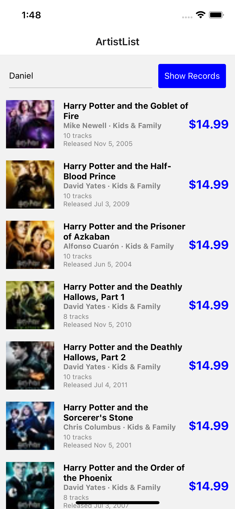
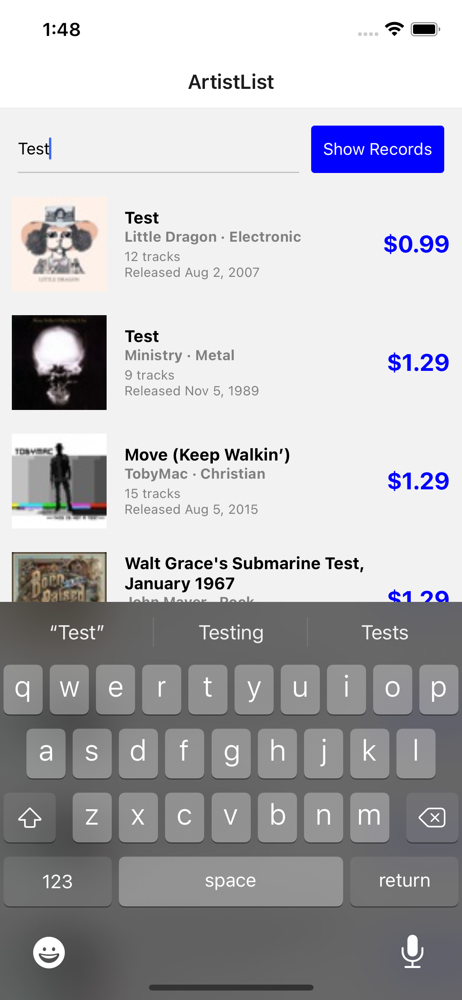

# Test - iTunes Artist listing test React-native App
iTunes Artist listing react native test. Android and iOS

## Development Tools
- Visual Studio Code (IDE)
- Xcode (iOS SDK required)
- Android Studio (Android SDK required)
- React Native version: 0.63 (https://reactnative.dev/versions) 

## Screenshot
 

MacOS for iOS simulator
VM is fine in case you are on Linux or Windows

## Language
React Native (Typescript)

## Getting the app up and running
Nodejs version (Active LTS V.14)

Clone the repository from git \
`git clone https://github.com/crazy-me-dev/react-native-itunesartist-display.git` \

Install dependencies \
`npm install`

Install cocoapod dependencies (for iOS only) \
`npx pod-install`

Run on iOS emulator \
`npx reac-native run-ios`

Run on Android emulator \
`npx reac-native run-android`

Test \
`npm test`

iOS emulator: https://docs.expo.io/workflow/ios-simulator/ \
Android emulator: https://docs.expo.io/workflow/android-studio-emulator/